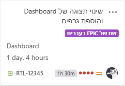

# Jira RTL Extension

A lightweight browser extension that improves the display of **Right-to-Left (RTL) languages in Jira Cloud**.  
It automatically adjusts layouts and styles, so that Jira pages look natural when working in Hebrew, Arabic, and other RTL languages.

---

## Features
- Automatically applies RTL fixes across pages in Jira Cloud.
- Supports fields like ticket summary, ticket description, comments, and many more - both in display and edit modes.
- Works out of the box after installation, no manual configuration needed.

---

## Installation
You can install the extension directly from your browser's extension store:

[Chrome Web Store](https://chromewebstore.google.com/detail/jira-rtl/mnllbchpmnjgjcamlaghhefmimpkgbad)  
Microsoft Edge Web Store (coming soon)  
Firefox Add-ons (coming soon)

If you want to install the extension manually from source code (for development purposes):
1. Clone this repo.
2. Run commands `npm install` and `npm run build` (requires node.js and npm installed).
3. In Chrome/Edge: open `chrome://extensions` or `edge://extensions`, enable *Developer mode*, press *Load unpacked*, and choose the `dist` folder.
4. In Firefox: open `about:debugging#/runtime/this-firefox`, click *Load Temporary Add-on*, and select the manifest file inside the `dist` folder.

---

## Settings popup
- **Enable/Disable** - Quickly toggle the extension on or off.  

All settings are saved automatically in the browser storage.

---

## Notes
- Fields with pure English or other LTR text, are never affected.
- **Code blocks and Code snippets stay LTR by design** (keeps technical text readable).
  
  Example: `Notepad++` with RTL direction would otherwise appear as "++Notepad".
  
  Another example: An SQL query with Hebrew text like:  
  `SELECT * FROM Users WHERE Name = 'דוד'`  
  will still display Left-to-Right for consistency.
- **Editable fields:** typing RTL text will flip the entire content alignment automatically (excluding code blocks).  
After saving, paragraphs/lists will individually adjust directions based on their own content.
- **Coverage:** most Jira Cloud fields that can contain RTL text are supported.
- **Tested on Jira Cloud only** (Other Jira environments may behave differently).

---

## Supported Writing Scripts

This extension detects characters from the following right-to-left writing scripts (alphabets),  
and supports the languages that use them:

| Writing Script | Languages |
|----------------|-----------|
| Hebrew         | Hebrew, Yiddish |
| Arabic         | Arabic, Persian/Farsi, Urdu, Pashto, Kurdish, Sindhi |
| Thaana         | Dhivehi (Maldives) |
| N’Ko           | N’Ko (Western African) |
| Adlam          | Fulani (Modern African) |
| Mandaic        | Mandaic (Mandaean religion) |
| Syriac         | Aramaic, Assyrian, Chaldean (ancient languages - basically nobody will write this in Jira) |

---

## Feedback & Issues
If you encounter bugs or want to suggest improvements, please [open an issue](../../issues).

---

## Disclaimer
This extension depends on Jira’s current page layout and element structure, so long-term compatibility isn't guaranteed.  
If Atlassian changes the site layout, CSS classes, or element IDs; the extension may stop working as intended.
